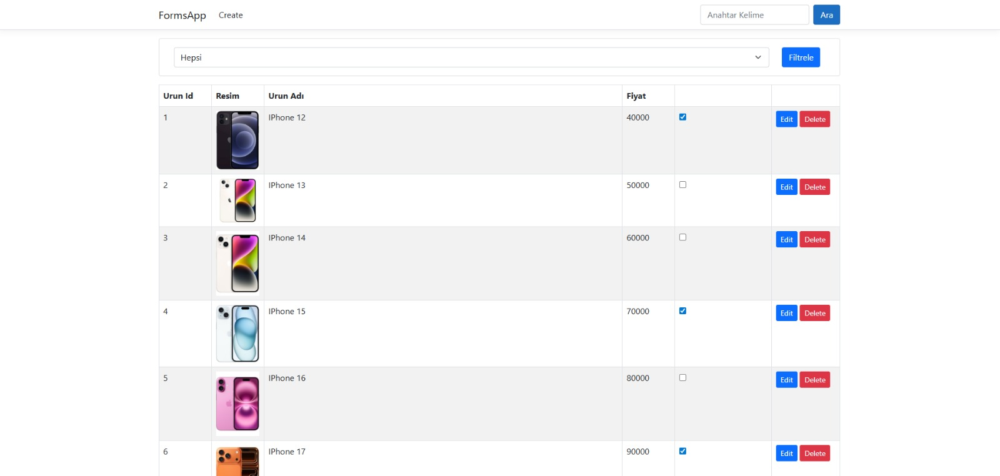
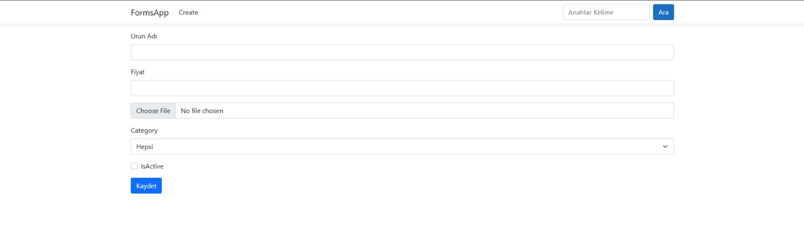
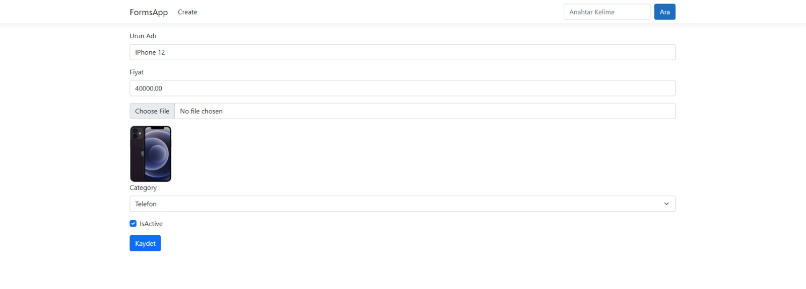

# FormsApp - ASP.NET Core MVC

ASP.NET Core MVC öğrenme sürecinde geliştirilen ürün yönetimi uygulaması.

## Ekran Görüntüleri

## Öğrenilen Konular

- MVC mimarisi (Model, View, Controller)
- GET/POST form işlemleri
- Model Binding ve Form Validations
- Tag Helpers
- ProductViewModel kullanımı
- Dosya yükleme (File Upload)
- CRUD işlemleri (Create, Read, Update, Delete)
- Batch Update

## Özellikler

- Ürün listeleme, arama ve kategoriye göre filtreleme
- Ürün ekleme (resim yükleme ile)
- Ürün düzenleme
- Ürün silme
- Toplu IsActive güncelleme (Batch Update)

## Teknolojiler

- ASP.NET Core MVC (.NET 8)
- C#
- Bootstrap 5
- HTML/CSS
